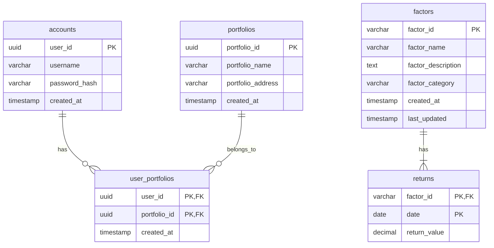

# labfolio
Open-sourced portfolio analysis stack

# quickstart


# architecture


# project structure

Project subdirectories are as follows:

| Directory | Description |
|-----------|-------------|
| `api`     | REST API built with [FastAPI](https://fastapi.tiangolo.com/), serves the `dashboard` |
| `dashboard`      | Dashboard built with [Streamlit](https://streamlit.io/), consumes the `api` |
| `lambda`  | Lambda functions for updating factor returns |
| `common`  | Shared code between `api` and `dashboard` |

## `api`


## `dashboard`


## `lambda`

Factor returns are constantly changing. Lambda is used in labfolio for one purpose: to update the returns for the factors (daily). Here are the short details:

| File | Description |
|-----------|-------------|
| `app.py`     | Lambda function for updating factor returns |
| `Dockerfile`  | Docker image definition for the Lambda function. This is stored in Amazon ECR |
| `update_image.sh`  | Script for updating the Lambda image in Amazon ECR |
| `requirements.txt`  | Python dependencies for the Lambda function |
| `labfolio-factors-daily-update.yaml`  | AWS SAM template for the Lambda function. You should be able to replicate the function by importing this template file. Be sure to update the placeholder values. |

You can see detailed instructions for updating the Lambda image in the [appendix](#appendix).

## `common`


# database schema

*Using [PostgreSQL](https://www.postgresql.org/) via [AWS RDS](https://aws.amazon.com/rds/).*



You can also find the entire database schema written as SQL commands in the [appendix](#appendix).


# acknowledgements

| Resource | Thanks |
|------|---------|
| [giuseppe paleologo](https://linktr.ee/paleologo) | For inspiring this project |
| [yfinance](https://pypi.org/project/yfinance/) | For generously providing free financial data |
| [cursor-ai](https://www.cursor.ai/) | For making coding easier and more efficient |
| [claude-3.5](https://www.anthropic.com/chat) | *used with cursor* |

# appendix

## Update Lambda Image Script

The `update_image.sh` script automates the process of building and deploying Docker images to Amazon ECR (Elastic Container Registry) for use with AWS Lambda.

Prerequisites:

- AWS CLI configured with appropriate credentials
- Docker installed and running
- `AWS_ACCOUNT_ID` environment variable set
- region is set to `us-east-1` (you can change this in the script if you need to)

Usage:

```bash
./update_image.sh <image_name> <repository_name>
```

Parameters:

- `image_name`: The name to give the local Docker image, I use `labfolio-factors-daily-update`
- `repository_name`: The name of your ECR repository, I use `labfolio`

What it does:

1. Validates that `AWS_ACCOUNT_ID` is set
2. Builds a Docker image compatible with AWS Lambda (linux/amd64)
3. Authenticates with Amazon ECR
4. Tags the local image for ECR
5. Pushes the image to your ECR repository

Example:

```bash
./update_image.sh labfolio-factors-daily-update labfolio
```

## Database Schema SQL

Below is the entire database schema for the project. You can replicate the entire backend database by running the following SQL commands.

```sql
-- schema for user management
CREATE SCHEMA IF NOT EXISTS user_management;

-- accounts table
CREATE TABLE user_management.accounts (
    user_id UUID PRIMARY KEY DEFAULT gen_random_uuid(),
    username VARCHAR(255) NOT NULL UNIQUE,
    password_hash VARCHAR(255) NOT NULL,  -- store ppls passwords as hash
    created_at TIMESTAMP DEFAULT CURRENT_TIMESTAMP
);

-- portfolios table
CREATE TABLE user_management.portfolios (
    portfolio_id UUID PRIMARY KEY DEFAULT gen_random_uuid(),
    portfolio_name VARCHAR(255) NOT NULL,
    portfolio_address VARCHAR(512),  -- S3 address
    created_at TIMESTAMP DEFAULT CURRENT_TIMESTAMP
);

-- user-portfolio mapping table
CREATE TABLE user_management.user_portfolios (
    user_id UUID REFERENCES user_management.accounts(user_id) ON DELETE CASCADE,
    portfolio_id UUID REFERENCES user_management.portfolios(portfolio_id) ON DELETE CASCADE,
    created_at TIMESTAMP DEFAULT CURRENT_TIMESTAMP,
    PRIMARY KEY (user_id, portfolio_id)
);

-- indexes
CREATE INDEX idx_accounts_username ON user_management.accounts(username);
CREATE INDEX idx_portfolios_name ON user_management.portfolios(portfolio_name);

-- schema for factor management
CREATE SCHEMA IF NOT EXISTS factor;

-- factors table
CREATE TABLE factor.factors (
    factor_id VARCHAR(50) PRIMARY KEY NOT NULL UNIQUE, -- e.g., 'MKT'
    factor_name VARCHAR(255) NOT NULL, -- e.g., 'Market'
    factor_description TEXT,
    factor_category VARCHAR(100),  -- e.g., 'Style, Country'
    created_at TIMESTAMP DEFAULT CURRENT_TIMESTAMP,
    last_updated TIMESTAMP DEFAULT CURRENT_TIMESTAMP
);

-- factor returns table (enhanced version of your factor.returns)
CREATE TABLE factor.returns (
    factor_id VARCHAR(50) REFERENCES factor.factors(factor_id) ON DELETE CASCADE,
    date DATE NOT NULL,
    return_value DECIMAL(10,6) NOT NULL,  -- 6 decimal precision for returns
    PRIMARY KEY (factor_id, date)
);

-- indexes
CREATE INDEX idx_factor_returns_date ON factor.returns(date);
CREATE INDEX idx_factors_id ON factor.factors(factor_id);
```